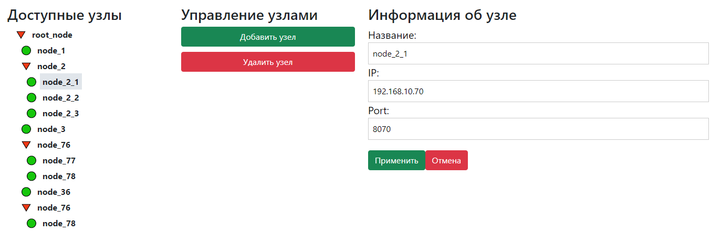

# Inobitec frontend

This project was bootstrapped with [Create React App](https://github.com/facebook/create-react-app).\
This is frontend part of work for Inobitec practice

## Available Scripts

In the project directory, you can run:

### `npm start`

Runs the app in the development mode.\
Open [http://localhost:3000](http://localhost:3000) to view it in the browser.

The page will reload if you make edits.\
You will also see any lint errors in the console.

## Thanks

Thanks a lot for the implementation tree view [@TWTZptr](https://github.com/TWTZptr)